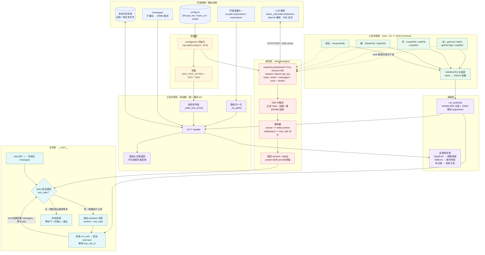
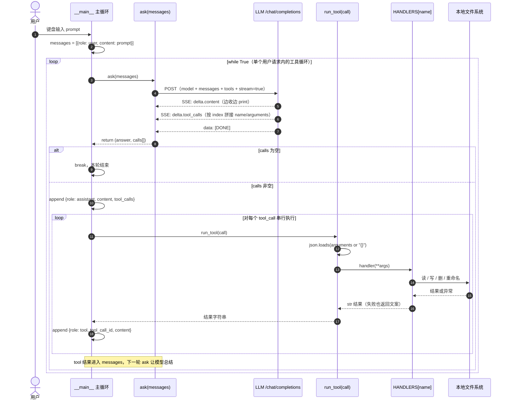
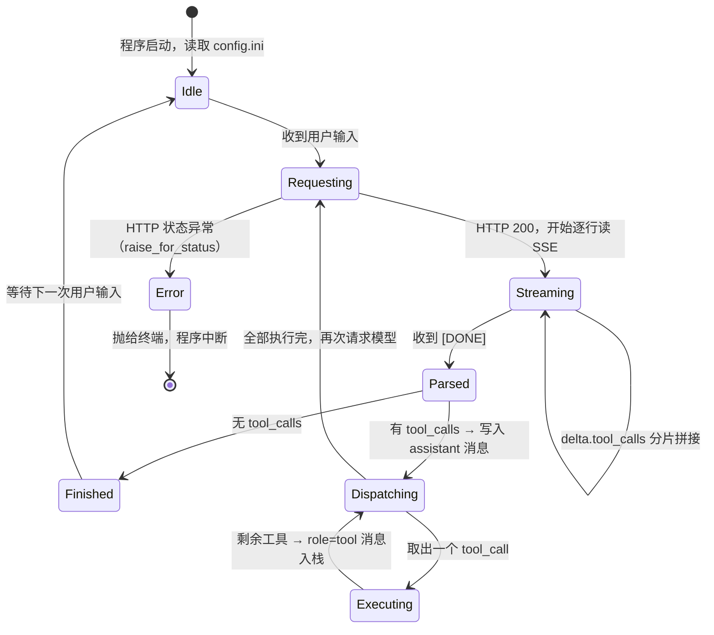
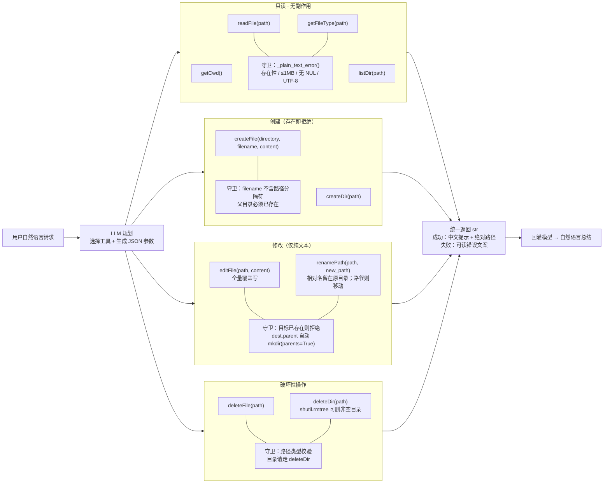

# chat-tq-tool-file0ps.py 代码架构

一个「流式 Chat Completions + Function Calling」的本地文件操作 Agent。每个 `.mmd` 只放一张图；这一页把四张图放在一起预览。

## 图 1：整体分层与依赖

```mermaid
flowchart TB
    subgraph L0["外部依赖 / 基础设施"]
        direction LR
        CFG[("config.ini<br/>[llm] api_key / base_url / model")]
        ENV["环境变量与 ~<br/>os.path.expandvars / expanduser"]
        LLM["LLM 服务<br/>{base_url}/chat/completions<br/>OpenAI 兼容 · SSE 流式"]
        FS[("本地文件系统<br/>目录 / 纯文本文件")]
        MIME["mimetypes<br/>扩展名 → MIME 推测"]
    end

    subgraph L1["配置层"]
        INIT["configparser 初始化<br/>cfg.read('config.ini', utf-8)"]
        CONST["常量<br/>MAX_TEXT_BYTES = 1024 * 1024"]
    end

    subgraph L2["工具声明层 · tools（10 个 JSON Schema）"]
        direction LR
        T1["读：getCwd / listDir<br/>getFileType / readFile"]
        T2["写：createFile / editFile<br/>createDir"]
        T3["删：deleteFile / deleteDir"]
        T4["改名：renamePath"]
        REG["HANDLERS 注册表<br/>name → Python 函数"]
    end

    subgraph L3["工具实现层 · 纯函数（统一返回 str）"]
        direction LR
        U1["路径归一化<br/>_as_path()"]
        U2["纯文本判定<br/>_plain_text_error()"]
        U3["10 个 handler"]
        U4["错误以文案返回<br/>不向调用方抛异常"]
    end

    subgraph L4["调度层"]
        RUN["run_tool(call)<br/>HANDLERS 分发 + JSON 解析 arguments"]
        ERRM["异常转文案<br/>TypeError → 参数错误<br/>OSError → 操作失败<br/>未注册 → 未知工具"]
    end

    subgraph L5["通信层 · ask(messages)"]
        REQ["requests.post(stream=True, timeout=60)<br/>headers: Bearer api_key<br/>body: model + messages + tools + stream"]
        SSE["SSE 行解析<br/>过滤 'data: ' 前缀 / 遇 [DONE] 结束"]
        ACC["累积器<br/>answer += delta.content<br/>calls[index] += tool_calls 分片"]
        OUT["返回 (answer, calls[])<br/>content 实时 print 到终端"]
    end

    subgraph L6["主流程 · __main__"]
        M1["input('你: ') → 初始化 messages"]
        M2{"ask() 是否返回<br/>tool_calls？"}
        M3["追加 assistant 消息<br/>content + tool_calls"]
        M4["逐条 run_tool → 追加 role=tool<br/>携带 tool_call_id"]
        M5["本轮结束<br/>等待下一次输入 / 退出"]
    end

    CFG --> INIT --> CONST
    INIT --> REQ
    CONST --> U2
    T1 --> REG
    T2 --> REG
    T3 --> REG
    T4 --> REG
    REG --> RUN
    U1 --> U3
    U2 --> U3
    U3 --> U4
    U3 --> ERRM
    RUN --> U3
    MIME --> U3
    ENV --> U1
    FS <--> U3
    RUN --> M4

    REQ --> SSE --> ACC --> OUT
    OUT --> M2
    LLM <-->|"HTTP POST / SSE chunk"| REQ
    M1 --> M2
    M2 -->|"有：需要执行工具"| M3
    M3 --> M4
    M4 -->|"tool 结果回灌 messages，再次 ask"| M2
    M2 -->|"无：模型给出最终答复"| M5

    T1 -.->|"tools 随每次请求下发"| REQ
    T2 -.-> REQ
    T3 -.-> REQ
    T4 -.-> REQ

    classDef ext fill:#eef3ff,stroke:#5b7bd5,color:#1b2b4b;
    classDef cfg fill:#fff6e0,stroke:#d8a13a,color:#4a3410;
    classDef tool fill:#eaf7ee,stroke:#3f9a5d,color:#123a22;
    classDef impl fill:#f2ecff,stroke:#7c5bd0,color:#2b1a4b;
    classDef comm fill:#ffecec,stroke:#d05b5b,color:#4b1b1b;
    classDef flow fill:#e6f7f9,stroke:#2e8f9e,color:#0c3a42;

    class CFG,ENV,LLM,FS,MIME ext;
    class INIT,CONST cfg;
    class T1,T2,T3,T4,REG tool;
    class U1,U2,U3,U4,RUN,ERRM impl;
    class REQ,SSE,ACC,OUT comm;
    class M1,M2,M3,M4,M5 flow;
```

## 图 2：一次工具调用的完整时序

```mermaid
sequenceDiagram
    autonumber
    actor User as 用户
    participant Main as __main__ 主循环
    participant Ask as ask(messages)
    participant API as LLM /chat/completions
    participant Run as run_tool(call)
    participant H as HANDLERS[name]
    participant Disk as 本地文件系统

    User->>Main: 键盘输入 prompt
    Main->>Main: messages = [{role: user, content: prompt}]
    loop while True（单个用户请求内的工具循环）
        Main->>Ask: ask(messages)
        Ask->>API: POST（model + messages + tools + stream=true）
        API-->>Ask: SSE: delta.content（边收边 print）
        API-->>Ask: SSE: delta.tool_calls（按 index 拼接 name/arguments）
        API-->>Ask: data: [DONE]
        Ask-->>Main: return (answer, calls[])

        alt calls 为空
            Main->>Main: break，本轮结束
        else calls 非空
            Main->>Main: append {role: assistant, content, tool_calls}
            loop 对每个 tool_call 串行执行
                Main->>Run: run_tool(call)
                Run->>Run: json.loads(arguments or "{}")
                Run->>H: handler(**args)
                H->>Disk: 读 / 写 / 删 / 重命名
                Disk-->>H: 结果或异常
                H-->>Run: str 结果（失败也返回文案）
                Run-->>Main: 结果字符串
                Main->>Main: append {role: tool, tool_call_id, content}
            end
            Note over Main,Ask: tool 结果进入 messages，下一轮 ask 让模型总结
        end
    end
```

## 图 3：单轮工具调用状态机

```mermaid
stateDiagram-v2
    [*] --> Idle: 程序启动，读取 config.ini
    Idle --> Requesting: 收到用户输入
    Requesting --> Streaming: HTTP 200，开始逐行读 SSE
    Streaming --> Streaming: delta.content 累加并打印
    Streaming --> Streaming: delta.tool_calls 分片拼接
    Streaming --> Parsed: 收到 [DONE]
    Parsed --> Finished: 无 tool_calls
    Parsed --> Dispatching: 有 tool_calls → 写入 assistant 消息
    Dispatching --> Executing: 取出一个 tool_call
    Executing --> Dispatching: 剩余工具 → role=tool 消息入栈
    Dispatching --> Requesting: 全部执行完，再次请求模型
    Finished --> Idle: 等待下一次用户输入
    Requesting --> Error: HTTP 状态异常（raise_for_status）
    Error --> [*]: 抛给终端，程序中断
```

## 图 4：工具能力分组与安全约束

```mermaid
flowchart LR
    USERQ["用户自然语言请求"] --> PLAN["LLM 规划<br/>选择工具 + 生成 JSON 参数"]

    PLAN --> G1
    PLAN --> G2
    PLAN --> G3
    PLAN --> G4

    subgraph G1["只读 · 无副作用"]
        direction TB
        A1["getCwd()"]
        A2["listDir(path)"]
        A3["getFileType(path)"]
        A4["readFile(path)"]
        C1["守卫：_plain_text_error()<br/>存在性 / ≤1MB / 无 NUL / UTF-8"]
        A4 --- C1
        A3 --- C1
    end

    subgraph G2["创建（存在即拒绝）"]
        direction TB
        B1["createFile(directory, filename, content)"]
        B2["createDir(path)"]
        C2["守卫：filename 不含路径分隔符<br/>父目录必须已存在"]
        B1 --- C2
    end

    subgraph G3["修改（仅纯文本）"]
        direction TB
        D1["editFile(path, content)<br/>全量覆盖写"]
        D2["renamePath(path, new_path)<br/>相对名留在原目录；路径则移动"]
        C3["守卫：目标已存在则拒绝<br/>dest.parent 自动 mkdir(parents=True)"]
        D1 --- C3
        D2 --- C3
    end

    subgraph G4["破坏性操作"]
        direction TB
        E1["deleteFile(path)"]
        E2["deleteDir(path)<br/>shutil.rmtree 可删非空目录"]
        C4["守卫：路径类型校验<br/>目录请走 deleteDir"]
        E1 --- C4
        E2 --- C4
    end

    G1 --> RES
    G2 --> RES
    G3 --> RES
    G4 --> RES
    RES["统一返回 str<br/>成功：中文提示 + 绝对路径<br/>失败：可读错误文案"] --> LLM2["回灌模型 → 自然语言总结"]
```
